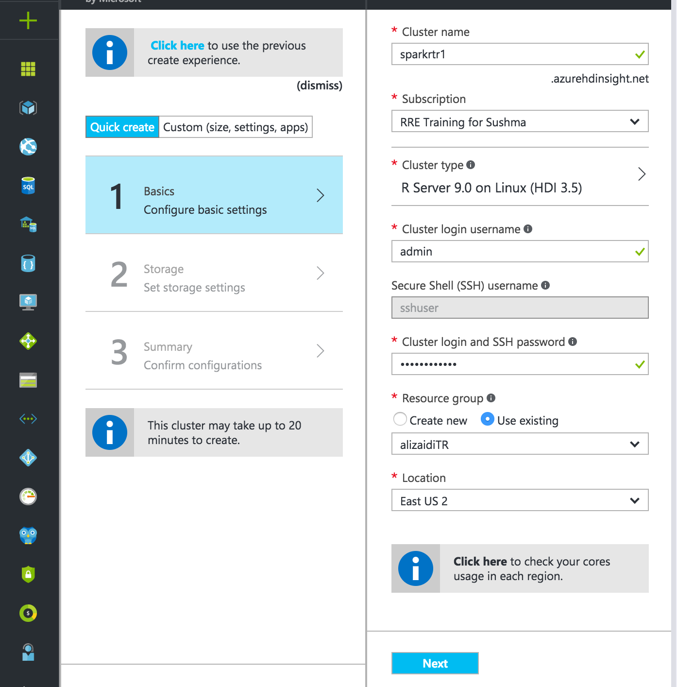
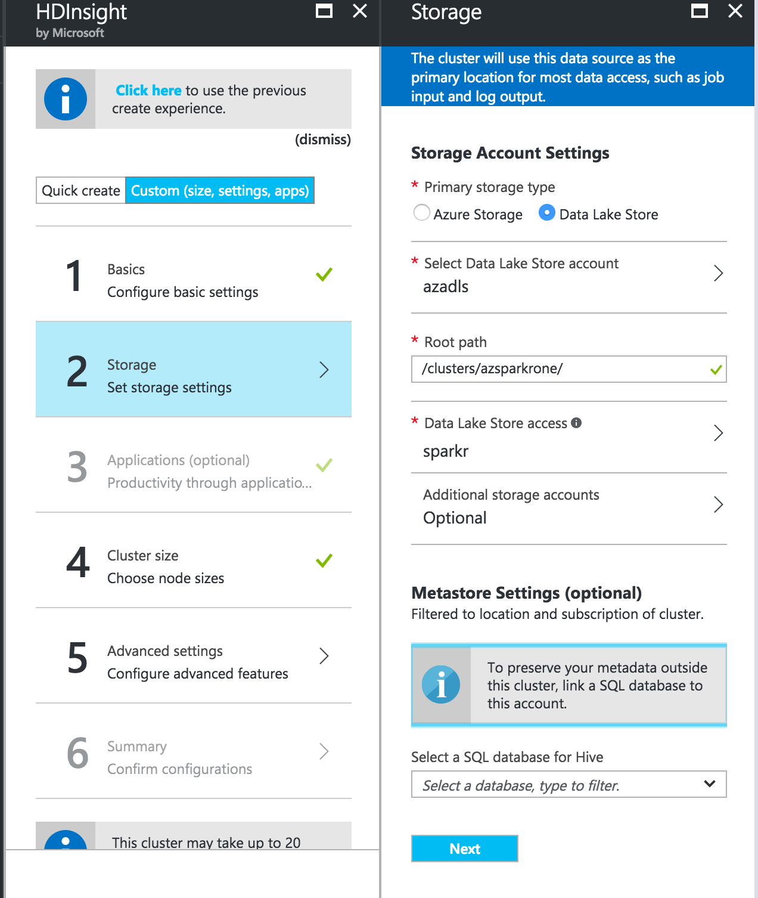
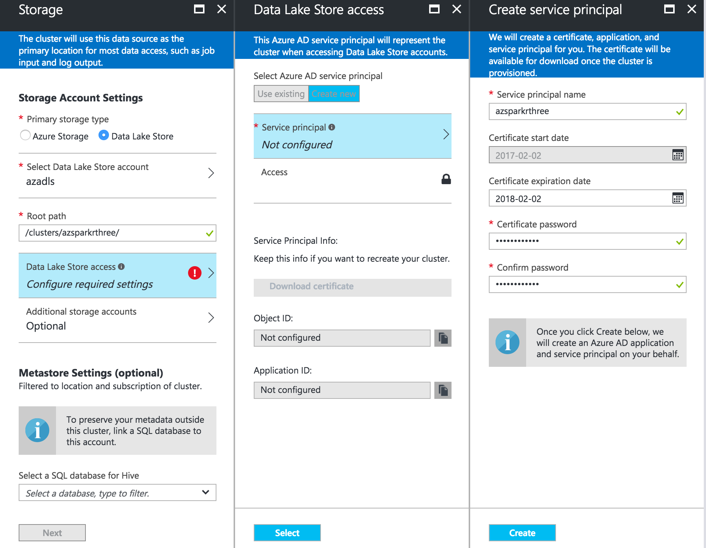
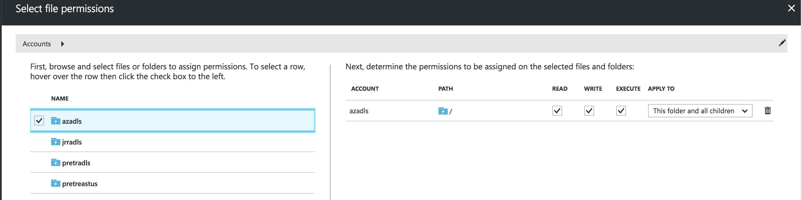
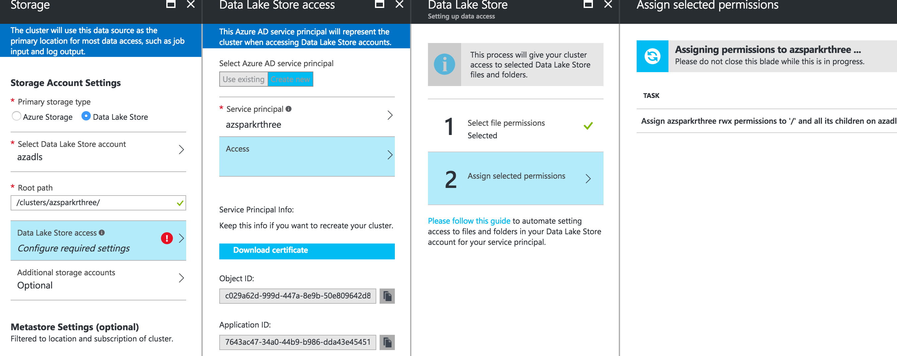
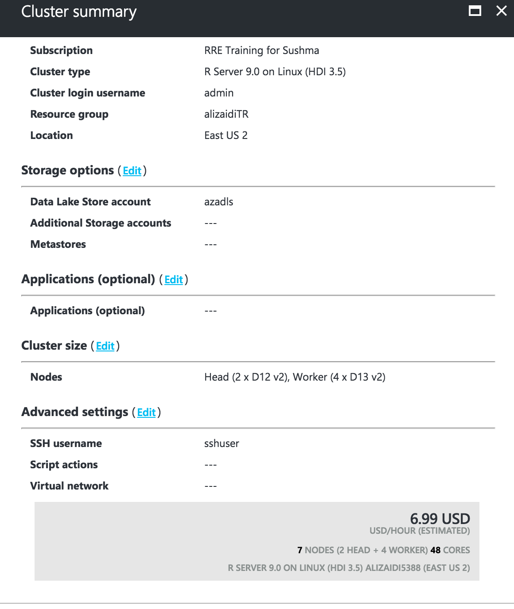

Provisioning an R Server on Spark Cluster with the Azure Portal
===============================================================

In this lab, you'll provision an HDInsight R Server on Spark cluster from the [azure portal](portal.azure.com). 

1. Login to the [Azure Portal](portal.azure.com).
2. Select _+_ at the top left -> _Intellgience + analytics_ -> _HDInsight_
3. In the basics pane, select a unique cluster name and your subscription. For cluster type, pick "R Server 9.0 on Linux (HDI 3.5)".
    - keep the RStudio Server box checked!
4. Use admin as your cluster login username
5. Make a password and don't forget it!
6. Reuse or create a resource group to associate with the cluster
7. Set East US 2 as your region
8. For storage, select Data Lake Store as your primary storage account
9. Select the Data Lake Store you've used since Monday.
    
10. For the root path, select `/clusters/yourclustername/`.
    - Note, I've seen that just using `/clusters/` as the root path will make `/clusters` the root directory for HDFS. This makes it difficult to have multiple clusters at once.
    - Let me know if this option does not work for you
    
11. Select Data Lake Store access and either create a new service principal or use one you've saved from before
    
    - you can download the certificate to reuse for later
12. Select Data Lake Store Access -> Access.
13. Check your Data Lake Store account from the populated list
    
14. Click select -> Run. You'll give the cluster access to the whole ADLS
    - This isn't ideal, but is the easiest solution
    - If you prefer, you can select just `ghinisights` and `clusters`
    
15. Click next -> Summary
16. Scroll the cluster size, and click edit
17. For cluster size, change worker node size to D13v2
    - minimum nodes for labs: 2
    - maximum nodes for labs: 6
    
18. Click next -> next
19. Review summary, and deploy!
    